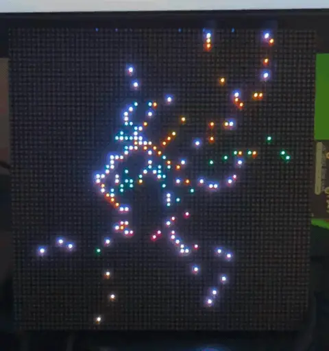

# ns-pixels



A live train map for the Netherlands rendered on a 64×64 RGB LED matrix. Every
train currently running on the network of NS — the main Dutch passenger railway
operator — shows up as a single colored pixel that drifts across the country in
real time. Colors encode either the rolling stock type (SLT, VIRM, ICNG, …) or
the service category (Sprinter, Intercity, Intercity Direct).

Two map views auto-cycle every 5 minutes: the full country, and an 80 km square
zoom on the Randstad where the train density is too high to be legible at the
country-wide scale.

## Hardware

- **64×64 RGB LED matrix, 2.5 mm pitch** —
  [Adafruit 3649](https://www.adafruit.com/product/3649). Any HUB75 64×64
  panel with the same pinout works; the 2.5 mm pitch gives a ~16 cm square display.
- **Adafruit Matrix Portal S3** —
  [Adafruit 5778](https://www.adafruit.com/product/5778). An ESP32-S3 board
  that plugs straight into the IDC connector on the back of the panel,
  wires up the HUB75 signals, and exposes spare GPIOs on a side header.
  Includes 8 MB flash and 2 MB PSRAM, both of which the firmware uses.

A typical view has only a few hundred LEDs lit at any moment, so total draw
stays under 500 mA — the Matrix Portal can run both itself and the panel
straight off its USB-C input. No separate panel PSU needed.

The Matrix Portal S3's pinout matches the firmware's pin assignments out of
the box. If you wire up a generic ESP32-S3 board to a HUB75 panel yourself,
look at `src/bin/main.rs` for the expected GPIOs (R1/G1/B1/R2/G2/B2, address
lines A–E, CLK, LAT, OE) and adjust to taste. Don't forget about the level shifters
between 3.3 V ESP and 5 V HUB75!

The two user buttons (UP / DOWN) are the ones built into the Matrix Portal board,
on GPIO6 and GPIO7 — these can be remapped as well, see `src/bin/main.rs`.

## Data sources

- **Train positions** come from [NDOV Loket](https://www.ndovloket.nl/)'s public ZMQ feed
  (`pubsub.besteffort.ndovloket.nl:7664`, topic `/RIG/NStreinpositiesInterface5`).
  The board subscribes directly, no registration needed.
- **Train type and service category** come from the
  [NS Public Travel Information API](https://apiportal.ns.nl/) (the
  `virtual-train-api` and `reisinformatie-api` endpoints). You need a free
  account on the NS API portal to get a subscription key.

## Build and flash

This is a no-std Rust project targeting `xtensa-esp32s3-none-elf`. You need:

- A working **ESP-RS toolchain** — the easiest path is
  [`espup`](https://github.com/esp-rs/espup):
  ```sh
  cargo install espup
  espup install
  source ~/export-esp.sh
  ```
- **`espflash`** for flashing and serial monitoring:
  ```sh
  cargo install espflash
  ```

The build pulls a few values in at compile time via `env!()`. These live in
`.cargo/config.local.toml`, which is git-ignored. `.cargo/config.toml` includes
it via its `include` key, so copy the template and fill it in:

```sh
cp .cargo/config.local.toml.example .cargo/config.local.toml
```

```toml
SSID = "<your wifi SSID>"
PASSWORD = "<your wifi password>"
NS_API_KEY = "<your NS API portal subscription key>"
```

Then:

```sh
cargo run --release
```

`cargo run` invokes `espflash flash --monitor`, so the firmware is flashed
over USB and you get a serial log immediately. On boot the device connects
to wifi, subscribes to the NDOV feed, and starts rendering within a few
seconds; train type/service enrichment fills in over the first minute or
two as the NS API calls complete.

## Operating the display

- **UP button (short press)** — cycle the visualization mode (how the color
  of a multi-train pixel is animated).
- **UP button (long press, ~1 s)** — switch between the full-NL map and the
  Randstad zoom. Not persisted; the device starts in full-NL mode after a reboot.
- **DOWN button** — toggle between coloring by rolling stock type and
  coloring by service category.

Visualization and color mode selections are saved to the on-board flash and
restored on the next boot.

## License

Dual-licensed under either of:

- Apache License, Version 2.0 ([`LICENSE-APACHE`](LICENSE-APACHE))
- MIT License ([`LICENSE-MIT`](LICENSE-MIT))

at your option.
